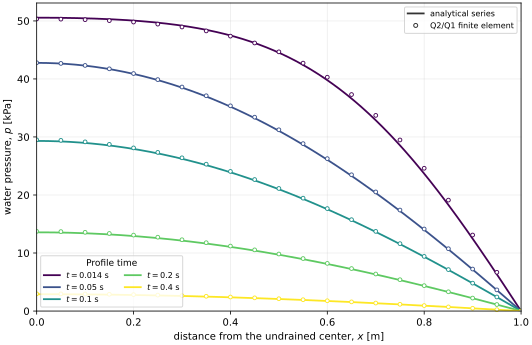

# Implicit-AD Biot coefficient: Mandel verification

This example verifies the numerical implementation of the nonlinear Biot
coefficient in a saturated porous body containing one deformable solid and one
water phase. The governing equations are the single-solid, single-fluid
specialization of the finite-deformation mixture theory. The coefficient is
calculated from a fixed-pressure implicit constitutive tangent and remains in
the automatic-differentiation graph used to assemble the coupled Jacobian.

The coefficient and finite-deformation effective-stress form follow
[Foster and Xu](https://doi.org/10.1016/j.jmps.2025.106263). The organization as
a total-Lagrangian mixed finite-element residual with automatic differentiation
is consistent with the implementation strategy described by
[Sun, Ostien, and Salinger](https://doi.org/10.1002/nag.2161).

## Finite-deformation equations

Let \(\boldsymbol{F}=\partial\boldsymbol{x}/\partial\boldsymbol{X}\) be the
skeleton deformation gradient and \(J=\det\boldsymbol{F}\). The total first
Piola--Kirchhoff stress is

\[
\boldsymbol{P}
=\boldsymbol{P}^{\prime\prime}
-B p J\boldsymbol{F}^{-T},
\tag{1}
\]

where \(\boldsymbol{P}^{\prime\prime}\) is the skeleton stress evaluated at
fixed water pressure \(p\). Quasi-static equilibrium on the skeleton reference
configuration is

\[
\operatorname{Div}_{\boldsymbol{X}}\boldsymbol{P}
+J\rho\boldsymbol{g}=\boldsymbol{0}.
\tag{2}
\]

With Lagrangian pore volume \(\Phi_f=J\phi_f\), water bulk modulus \(K_f\),
mineral bulk modulus \(K_s\), and reference relative mass flux
\(\boldsymbol{W}_f\), the pressure form of water mass balance is

\[
B\dot J
+\left(\frac{B-\Phi_f}{K_s}+\frac{\Phi_f}{K_f}\right)\dot p
+\frac{1}{\bar\rho_f}
\operatorname{Div}_{\boldsymbol{X}}\boldsymbol{W}_f=0,
\tag{3}
\]

with

\[
\boldsymbol{W}_f
=-\bar\rho_f J\boldsymbol{F}^{-1}
\frac{\boldsymbol{\kappa}}{\mu_f}
\boldsymbol{F}^{-T}\operatorname{Grad}_{\boldsymbol{X}}p.
\tag{4}
\]

These are the equations implemented in the displacement and water-pressure
rows. No small-strain replacement of \(\boldsymbol{F}\), \(J\), or the Piola
transform is made in the residual.

## Biot coefficient from an implicit tangent

The single-solid coefficient is

\[
B
=1-\frac{1}{v_{s0}}
\left.\frac{\partial\bar v_s}{\partial J}\right|_{p},
\tag{5}
\]

where \(v_{s0}\) is the reference bulk-solid specific volume and
\(\bar v_s\) is the current intrinsic-solid specific volume. The benchmark
uses the implicit states
\(\boldsymbol{y}=(r_s,\phi_s)\), where \(r_s\) is the intrinsic solid-density
ratio and \(\phi_s\) is the solid volume fraction. They satisfy

\[
\boldsymbol{R}(\boldsymbol{y},J,p)=\boldsymbol{0},
\qquad
\left.\frac{\partial\boldsymbol{y}}{\partial J}\right|_p
=-\left(\frac{\partial\boldsymbol{R}}{\partial\boldsymbol{y}}\right)^{-1}
\frac{\partial\boldsymbol{R}}{\partial J}.
\tag{6}
\]

At each quadrature point, `ADConstrainedSkeletonBiotMaterial` solves this local
linear tangent system with AD-valued entries, evaluates
\(\left.\partial\bar v_s/\partial J\right|_p\), and returns \(B\) as an AD
material property. `ADReferenceSolidStressMaterial` then inserts the same
property into Equation (1). Consequently, derivatives of \(B\) with respect to
displacement, pressure, and the implicit solid states enter the monolithic
Newton Jacobian.

For the mineral law used in this test, the implicit result has the independent
closed-form check

\[
B_{\mathrm{check}}
=1-\frac{K(1-\ln J)}{K_s r_s J^2},
\tag{7}
\]

which gives \(B_0=1-K/K_s=0.6\) at the reference state.

## Finite-element system

| Unknown | Space | Numerical role |
|---|---|---|
| skeleton displacement \((u_x,u_y)\) | continuous Q2 | finite-deformation momentum |
| water pressure \(p\) | continuous Q1 | storage and Darcy transport |
| implicit states \((r_s,\phi_s)\) | continuous Q2 | local solid constraints |

The Q2/Q1 displacement--pressure pair is used directly. This smooth,
single-fluid Mandel problem needs neither a P0 pressure enrichment nor an EG
facet operator.

## Mandel pressure comparison

The quarter domain is \(0\le x\le1\ \mathrm{m}\) and
\(0\le y\le0.1\ \mathrm{m}\). The left and bottom boundaries are symmetry
planes, the right boundary is drained, and the top is an impermeable rigid
platen under a constant \(100\ \mathrm{kPa}\) compressive resultant. The
analytical plane-strain solution is the series reported by
[Cheng and Detournay](https://doi.org/10.1002/nag.1610120508).

The figure plots water pressure against \(x\) at five times. Curves are the
analytical series; open circles are Q2/Q1 nodal values along \(y=0.05\ \mathrm{m}\)
from the \(40\times4\) mesh with \(\Delta t=0.002\ \mathrm{s}\).

Across the plotted profiles, the maximum pressure difference is
\(1.963\times10^{-2}\) of the analytical pressure scale. Over the complete
accepted time history and the three registered pressure probes, the maximum
normalized difference is \(3.709\times10^{-2}\). The maximum difference
between the implicit coefficient and Equation (7) is
\(5.41\times10^{-17}\) in the reported L2 norm.

The full numerical record and reproduction command are in
`validation/reports/mandel_implicit_biot.md`.
