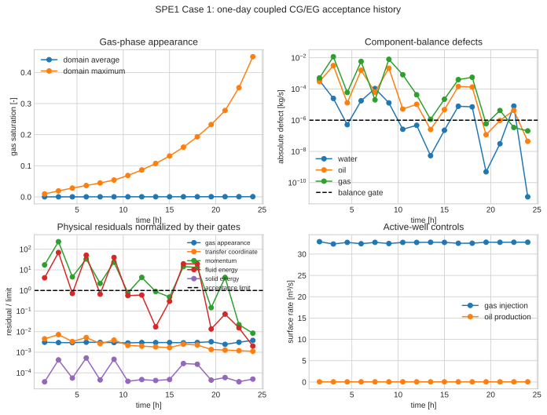
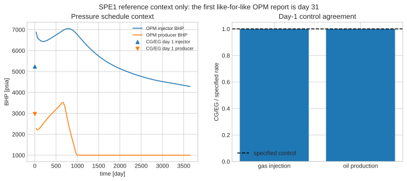

# SPE1 Case 1: exact one-day coupled residual system

This page documents the equations and MOOSE objects actually selected by the accepted one-day SPE1 Case 1 run. It is an audit of the executable input hierarchy, not a generic black-oil-model summary.

The accepted overlay is spe1_case1_q2_eg_phase_transforming.i, which includes spe1_case1_q2_eg_transient.i. The production runner disables the finite kinetic gas-transformation closure and uses SuperLU as the linear solver. The model contains a deformable solid matrix and three fluid components: water, stock-tank oil, and stock-tank gas. Oil and gas can transfer mass between their phase inventories; water does not participate in that transfer.

## What was actually solved

The active deck solves oil pressure \(p_o\), water saturation \(S_w\), gas saturation \(S_g\), solution-gas/oil ratio \(R_s\), gas transformation rate \(r_g\), solid displacement \(\mathbf u\), and the auxiliary pressure-like field \(\tau\). The enrichment overlay adds discontinuous P0 companions where configured by the EG variables.

The PVT material defines oil saturation algebraically:

\[
S_o=1-S_w-S_g. \tag{SPE1-1}
\]

It evaluates the SPE1 tables and returns reference component inventories:

\[
M_w^0=J\phi\rho_{w,sc}\frac{S_w}{B_w},\qquad
M_o^0=J\phi\rho_{o,sc}\frac{S_o}{B_o}, \tag{SPE1-2}
\]

\[
M_g^0=J\phi\rho_{g,sc}
\left(\frac{S_g}{B_g}+R_s\frac{S_o}{B_o}\right). \tag{SPE1-3}
\]

Here \(J=\det F\) and \(F\) is the solid deformation gradient. The material exposes time derivatives of these inventories; the component-balance kernels use those returned properties rather than reimplementing Equations (SPE1-2)--(SPE1-3).

## Fluxes selected by the input deck

The accepted run does **not** use a fixed-spatial-frame Darcy flux as its assembled flux property. The balances consume reference fluxes \(\mathbf W^\alpha\) (and derived reference component fluxes). This distinction matters in the coupled solid/fluid formulation.

### Water: standard reference Darcy material

Water uses ADStandardDarcyReferenceFluxMaterial in each of the three layers. Its pressure is tied to \(p_o\) in this deck: no water capillary-pressure material is supplied. With \(\mathbf k\) the intrinsic permeability tensor, \(k_{rw}\) the water relative permeability, \(\mu_w\) the viscosity, and \(\bar\rho_w\) the intrinsic water density, the material constructs

\[
m_w=\frac{\bar\rho_w k_{rw}\mathbf k}{\mu_w},\qquad
\mathcal M_w^0=m_wJF^{-1}F^{-T}, \tag{SPE1-4}
\]

\[
\mathbf W_w=-\mathcal M_w^0\nabla_Xp_o
+m_wJF^{-1}(\bar\rho_w\mathbf g). \tag{SPE1-5}
\]

The deck sets \(\mathbf g=(0,0,9.80665)\). It does not activate acceleration or a water capillary term. The material property supplied to the water component balance is water_reference_component_flux, derived from this reference-flux construction.

### Oil and gas: phase-transforming reference Darcy material

The production overlay replaces the base oil and gas Darcy materials with ADPhaseTransformingDarcyReferenceFluxMaterial. For \(f\in\{\mathrm{oil},\mathrm{gas}\}\), let \(\rho_f\) be bulk phase density, \(\phi_f=\rho_f/\bar\rho_f\), \(q_f^{ph}\) the phase conversion source, and \(\tau\) the auxiliary field. The active material computes

\[
D_f=\phi_f^2\mu_f+q_f^{ph}\mathbf k k_{rf}, \tag{SPE1-6}
\]

\[
\mathbf w_f=\frac{\rho_f\mathbf k k_{rf}}{D_f}
\left[
\rho_f\mathbf g-\phi_fF^{-T}\nabla_Xp_o
+q_f^{ph}\left(F^{-T}\nabla_X\tau-\dot{\mathbf u}\right)
\right],\qquad
\mathbf W_f=JF^{-1}\mathbf w_f. \tag{SPE1-7}
\]

The implementation contains a trial-path guard that replaces \(D_f\) by \(\phi_f^2\mu_f\) if the computed denominator is below its configured minimum. Capillary pressure, acceleration, and electric potential are inactive in this SPE1 deck. The overlay provides \(q_{\rm oil}^{ph}=-r_g\) and \(q_{\rm gas}^{ph}=+r_g\) through ADPhaseConversionSourceMaterial.

This is why an ordinary Darcy equation should not have been presented as the executed oil/gas residual: Equation (SPE1-7) includes the conversion-source and solid-motion terms, and its output is the reference flux \(\mathbf W_f\).

## Exact weak balance assembly

For a scalar component test function \(v\), ADEnrichedGalerkinScalarBalance assembles the continuous-field volume residual

\[
\mathcal R_c(v)=\int_{\Omega_0}
v\left(\dot M_c^0-Q_c^0\right)
-\nabla_Xv\mathbin{\cdot}\mathbf W_c^0\,dV_0. \tag{SPE1-8}
\]

ADEnrichedGalerkinScalarEnrichmentBalance supplies the companion P0 storage/source volume term; the EG face fluxes are assembled by the corresponding discontinuous-Galerkin flux kernels. Thus \(\mathbf W\), rather than a spatial \(\mathbf q\), is the quantity entering the integrated reference-domain balance.

| Conserved row | Storage property selected | Flux property selected | Well/source property selected |
| --- | --- | --- | --- |
| Water | benchmark_black_oil_water_reference_component_storage_rate | water_reference_component_flux | spe1_well_water_reference_component_source |
| Oil | benchmark_black_oil_oil_reference_component_storage_rate | oil_reference_component_flux | spe1_well_oil_reference_component_source |
| Dissolved gas | benchmark_black_oil_dissolved_gas_reference_component_storage_rate | dissolved_gas_reference_component_flux | spe1_well_dissolved_gas_reference_component_source |
| Free gas | benchmark_black_oil_free_gas_reference_component_storage_rate | gas_reference_relative_mass_flux | spe1_well_free_gas_reference_component_source |

The dissolved- and free-gas rows also receive phase-transfer source properties through ADReferenceComponentSourceTerm. Those opposite-signed sources move gas between the two phase inventories; they do not create or destroy total gas. The solid matrix balance is the material residual solid_reference_component_balance_residual.

## Other active equations and kernel audit

| Physical relation | Executed material property | Kernel/object family |
| --- | --- | --- |
| Phase-volume closure | phase_volume_constraint_residual | ADMaterialPropertyResidual, plus ADEnrichedGalerkinMaterialPropertyResidual |
| Gas-appearance equilibrium | benchmark_black_oil_gas_appearance_equilibrium_residual | ADMaterialPropertyResidual and EG companion |
| Rate reconstruction | gas_phase_transformation_rate and gas_phase_transformation_rate_enrichment | ADEGReconstructedScalarMaterial |
| Tau evolution | tau_evolution_residual | ADEnrichedGalerkinMaterialPropertyResidual |
| Solid momentum | reference solid momentum residuals, gravity, and oil/gas conversion insertion | ADReferenceSolidMomentum, ADReferenceGravity, ADPhaseMomentumConversionInsertionTerm |
| Fluid energy | reference energy storage, flux, source, and conversion-transfer work | ADReferenceEnergyStorageTerm, ADReferenceEnergyFluxTerm, ADReferenceEnergySourceTerm, ADReferenceEnergyConversionTransferWorkTerm |
| Solid energy | reference solid energy storage, flux, source, and interphase exchange | ADReferenceEnergyStorageTerm, ADReferenceEnergyFluxTerm, ADReferenceEnergySourceTerm |

The finite kinetic gas-transformation closure kernels named gas_phase_transformation_closure and gas_phase_transformation_enrichment_closure are explicitly inactive in the acceptance invocation. The active closure is therefore the equilibrium/appearance relation above, coupled to the reconstructed \(r_g\) field.

## Reference-limit note: not the active residual

The familiar black-oil equations using a spatial volumetric Darcy velocity are useful for comparison with conventional SPE1 descriptions. They are a reduction of this framework under fixed solid motion, \(J=1\), \(F=I\), and removal of the phase-conversion and tau-motion terms. They are **not** the equations passed to the active balance kernels for this run. The source derivation is retained in sections/correspondence_to_other_theories.tex; this page deliberately leads with the executed reference formulation.

## One-day coupled acceptance evidence

The accepted artifact is validation/results/spe1_case1/one_day_coupled_acceptance_20260820. At the one-day end state, reported residual measures included water \(-1.23\times10^{-11}\), oil \(-4.47\times10^{-8}\), gas \(2.07\times10^{-7}\), phase volume 0, tau \(1.11\times10^{-10}\), and maximum z-momentum \(8.43\times10^{-10}\). The gas-appearance residual was \(3.76\times10^{-10}\). The gas saturation maximum was 0.4506767.

The observed injection rate was 32.7739162 against the target 32.774128; observed oil production was 0.0368026140 against target 0.0368026146. These are acceptance diagnostics for the executed one-day case, not a claim of a full 10-day SPE1 benchmark match.

The repository also carries independent PVT and coupled partition regression references. The partition regression finishes with \(R_s=1.2\), \(S_g=0.57435897435897\), \(r_g=0.18092307692308\), and total-gas L2 error \(1.24\times10^{-16}\) against its gold data. Those are focused material/closure checks, separate from the coupled field acceptance above.

The checked-in OPM FLOW reference series begins at day 31, so it is intentionally shown as later-time comparison context rather than used to validate the one-day output.

## Reproduce the exact audited case

From the repository root, invoke the SPE1 acceptance runner used to create the artifact, preserving its command-line overrides for one simulated day, inactive kinetic closure kernels, and SuperLU. Before calling it, source the local MOOSE environment in the same shell. The canonical input hierarchy is:

~~~text
moose_app/examples/spe1_case1_q2_eg_phase_transforming.i
  includes spe1_case1_q2_eg_transient.i
  replaces oil/gas flux materials with ADPhaseTransformingDarcyReferenceFluxMaterial
  retains water ADStandardDarcyReferenceFluxMaterial
~~~

For an agentic reproduction request, use: “Run the one-day SPE1 Case 1 acceptance overlay, retain reference-flux W balances, disable the finite kinetic gas-transformation closure, use SuperLU, archive the final residuals and rates, and compare only with the declared one-day acceptance checks.”
