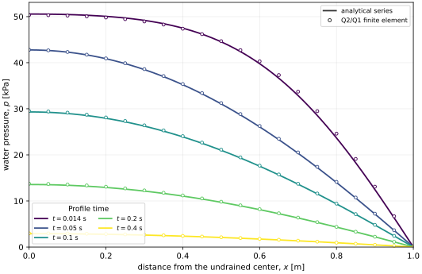

# Numerical implementation and Mandel verification of an implicit-AD Biot coefficient

## Scope

This report verifies one numerical operation: calculation of the
finite-deformation Biot coefficient from an implicit fixed-pressure tangent and
its use in a monolithic solid--water finite-element solve. The governing model
is the single-solid, single-fluid specialization in the multicomponent mixture
paper. The equations are stated here in their solid-reference form without
repeating that derivation.

The definition of the nonlinear coefficient and its effective-stress role are
given by [Foster and Xu](https://doi.org/10.1016/j.jmps.2025.106263). The
total-Lagrangian mixed finite-element presentation and residual-based use of
automatic differentiation follow the numerical approach described by
[Sun, Ostien, and Salinger](https://doi.org/10.1002/nag.2161). The analytical
Mandel comparison uses the plane-strain series of
[Cheng and Detournay](https://doi.org/10.1002/nag.1610120508).

## Solid-reference equations

The skeleton motion \(\boldsymbol{x}=\boldsymbol{\chi}(\boldsymbol{X},t)\)
defines

\[
\boldsymbol{F}
=\frac{\partial\boldsymbol{x}}{\partial\boldsymbol{X}},
\qquad
J=\det\boldsymbol{F}.
\tag{1}
\]

For water pressure \(p\), the total first Piola--Kirchhoff stress is

\[
\boldsymbol{P}
=\boldsymbol{P}^{\prime\prime}
-B p J\boldsymbol{F}^{-T},
\tag{2}
\]

where \(\boldsymbol{P}^{\prime\prime}\) is the skeleton stress obtained by
holding \(p\) fixed. Quasi-static equilibrium on the reference configuration is

\[
\operatorname{Div}_{\boldsymbol{X}}\boldsymbol{P}
+J\rho\boldsymbol{g}=\boldsymbol{0}.
\tag{3}
\]

The exact single-fluid mass balance uses the Lagrangian water mass
\(J\phi_f\bar\rho_f\),

\[
\frac{\partial}{\partial t}
\left(J\phi_f\bar\rho_f\right)
+\operatorname{Div}_{\boldsymbol{X}}\boldsymbol{W}_f=0.
\tag{4}
\]

For barotropic water and the finite-deformation Biot storage specialization,
define \(\Phi_f=J\phi_f\) and

\[
\frac{1}{M}
=\frac{B-\Phi_f}{K_s}+\frac{\Phi_f}{K_f}.
\tag{5}
\]

The pressure equation is then

\[
B\dot J+\frac{1}{M}\dot p
+\frac{1}{\bar\rho_f}
\operatorname{Div}_{\boldsymbol{X}}\boldsymbol{W}_f=0.
\tag{6}
\]

The reference relative mass flux is the Piola transform of Darcy transport,

\[
\boldsymbol{W}_f
=-\bar\rho_f J\boldsymbol{F}^{-1}
\frac{\boldsymbol{\kappa}}{\mu_f}
\boldsymbol{F}^{-T}\operatorname{Grad}_{\boldsymbol{X}}p.
\tag{7}
\]

Equations (2), (6), and (7) retain the finite-deformation pressure coupling,
storage, and permeability pull-back used by the implementation.

## Implicit Biot coefficient

For one solid phase, the nonlinear coefficient is

\[
B
=1-\frac{1}{v_{s0}}
\left.\frac{\partial\bar v_s}{\partial J}\right|_p,
\tag{8}
\]

where \(v_{s0}\) is the reference bulk-solid specific volume and
\(\bar v_s\) is the current intrinsic-solid specific volume. The constitutive
state is not an explicit function of \(J\). At each quadrature point, implicit
states \(\boldsymbol{y}\) satisfy

\[
\boldsymbol{R}(\boldsymbol{y},J,p)=\boldsymbol{0}.
\tag{9}
\]

Holding pressure fixed and differentiating Equation (9) gives the local tangent
system

\[
\left.\frac{\partial\boldsymbol{y}}{\partial J}\right|_p
=-\left(\frac{\partial\boldsymbol{R}}{
\partial\boldsymbol{y}}\right)^{-1}
\frac{\partial\boldsymbol{R}}{\partial J}.
\tag{10}
\]

The present closure uses the intrinsic density ratio \(r_s\) and solid volume
fraction \(\phi_s\), so
\(\boldsymbol{y}=(r_s,\phi_s)\). The two constraints are solid material mass
and a compressible-mineral equation of state,

\[
R_1
=\frac{J\phi_s r_s}{\phi_{s0}}-1=0,
\qquad
R_2
=\ln r_s
-\frac{1}{K_s}
\left(p-\frac{K\ln J}{\phi_{s0}J}\right)=0.
\tag{11}
\]

With the registered solid reference accumulation held fixed,

\[
\bar v_s
=\frac{J\phi_s}{J\rho_s},
\qquad
\left.\frac{\partial\bar v_s}{\partial J}\right|_p
=\frac{\partial\bar v_s}{\partial J}
+\frac{\partial\bar v_s}{\partial\boldsymbol{y}}
\mathbin{\cdot}
\left.\frac{\partial\boldsymbol{y}}{\partial J}\right|_p.
\tag{12}
\]

For Equation (11), the implicit result can be checked independently as

\[
B_{\mathrm{check}}
=1-\frac{K(1-\ln J)}{K_s r_s J^2}.
\tag{13}
\]

At \(J=r_s=1\), Equation (13) gives the classical reference value
\(B_0=1-K/K_s=0.6\).

## Nested automatic differentiation

`ADConstrainedSkeletonBiotMaterial` performs Equation (10) with AD-valued
constraint derivatives. Gaussian elimination uses raw values only to choose a
pivot; the matrix elimination, back substitution, specific-volume tangent, and
Equation (8) remain AD operations. This produces two derivative levels:

1. the inner implicit derivative
   \(\left.\partial\boldsymbol{y}/\partial J\right|_p\), which defines \(B\);
2. the outer MOOSE AD derivatives of the assembled residual, including the
   dependence of \(B\) on displacement, pressure, and implicit state fields.

`ADReferenceSolidStressMaterial` consumes the AD property \(B\) in Equation
(2). `ADReferenceSolidMomentum` and the pressure kernels then assemble the
coupled residual without a separately coded constitutive Jacobian.

For displacement test function \(\boldsymbol{w}\) and pressure test function
\(q\), the implemented weak rows are

\[
R_u(\boldsymbol{w})
=\int_{\Omega_0}
\operatorname{Grad}_{\boldsymbol{X}}\boldsymbol{w}:
\left(\boldsymbol{P}^{\prime\prime}
-BpJ\boldsymbol{F}^{-T}\right)\,\mathrm{d}V_0,
\tag{14}
\]

and

\[
R_p(q)
=\int_{\Omega_0}q
\left[
B\dot J
+\left(
\frac{B-J(1-\phi_s)}{K_s}
+\frac{J(1-\phi_s)}{K_f}
\right)\dot p
\right],\mathrm{d}V_0
-\int_{\Omega_0}
\operatorname{Grad}_{\boldsymbol{X}}q\mathbin{\cdot}
\frac{\boldsymbol{W}_f}{\bar\rho_f}\,\mathrm{d}V_0.
\tag{15}
\]

The numerical object map is compact:

| Operation | MOOSE object |
|---|---|
| \(\boldsymbol{F}\), \(J\), and rates | `ADSolidReferenceKinematics` |
| constraints in Equation (11) | `ADDerivativeParsedMaterial` and `ADMaterialPropertyResidual` |
| implicit tangent and \(B\) | `ADConstrainedSkeletonBiotMaterial` |
| \(\boldsymbol{P}^{\prime\prime}\) | `ADVolumetricBarotropicSkeletonStressMaterial` |
| total stress in Equation (2) | `ADReferenceSolidStressMaterial` |
| momentum row | `ADReferenceSolidMomentum` |
| pressure storage closure | `ADBiotPressureStorageMaterial` |
| pressure storage weak term | `ADReferenceMaterialStorageRateTerm` |
| Darcy flux | `ADBiotDarcyReferenceFluxMaterial` |
| pressure-flux weak term | `ADReferenceComponentFluxTerm` |

## Mandel problem

The plane-strain specimen has half-width \(a=1\ \mathrm{m}\) and half-height
\(b=0.1\ \mathrm{m}\). Symmetry permits solution on
\(0\le x\le a\), \(0\le y\le b\). The conditions are:

- \(u_x=0\) at \(x=0\) and \(u_y=0\) at \(y=0\);
- \(p=0\) at the drained boundary \(x=a\);
- zero normal water flux at the symmetry and platen boundaries;
- a rigid, frictionless top platen carrying a constant
  \(100\ \mathrm{kPa}\) compressive resultant.

Displacement and the two implicit solid states use continuous Q2 interpolation.
Water pressure uses continuous Q1 interpolation. The accepted mesh contains
\(40\times4\) QUAD9 elements and advances with
\(\Delta t=0.002\ \mathrm{s}\). This Q2/Q1 pair resolves the smooth pressure
field without a P0 enrichment, an EG interior-facet term, or pressure
stabilization.

The material parameters are:

| Parameter | Value |
|---|---:|
| skeleton bulk modulus \(K\) | \(1.0\ \mathrm{GPa}\) |
| shear modulus \(G\) | \(0.75\ \mathrm{GPa}\) |
| mineral bulk modulus \(K_s\) | \(2.5\ \mathrm{GPa}\) |
| water bulk modulus \(K_f\) | \(8.0\ \mathrm{GPa}\) |
| initial porosity \(\phi_{f0}\) | \(0.1\) |
| permeability \(\kappa\) | \(1.5\times10^{-12}\ \mathrm{m^2}\) |
| water viscosity \(\mu_f\) | \(10^{-3}\ \mathrm{Pa\,s}\) |

## Analytical pressure series

Let \(\nu\) and \(\nu_u\) denote the drained and undrained Poisson ratios,
\(B_{\mathrm{Sk}}\) the Skempton coefficient, and \(c\) the consolidation
coefficient. The positive roots \(\alpha_n\) satisfy

\[
\tan\alpha_n
=\frac{1-\nu}{\nu_u-\nu}\alpha_n.
\tag{16}
\]

For applied compressive stress \(P_0\), the analytical pressure is

\[
p(x,t)
=\frac{2P_0B_{\mathrm{Sk}}(1+\nu_u)}{3}
\sum_{n=1}^{\infty}
\frac{
\sin\alpha_n\cos\left(\alpha_n x/a\right)
-\sin\alpha_n\cos\alpha_n
}{
\alpha_n-\sin\alpha_n\cos\alpha_n
}
\exp\left(-\frac{\alpha_n^2ct}{a^2}\right).
\tag{17}
\]

The verifier uses the first twelve roots of Equation (16), matching the
Cheng--Detournay series used by the MOOSE PorousFlow Mandel reference.

## Pressure profiles and numerical result

The figure presents the benchmark in its conventional form: water pressure as
a function of \(x\), with a separate profile for each reported time. Solid
curves are Equation (17), and open circles are finite-element values sampled at
\(y=0.05\ \mathrm{m}\). The profiles use the accepted mesh and time increment.

The numerical profiles reproduce the transient pressure maximum at the
undrained center and the zero-pressure condition at the drained edge. Across
the five plotted times, the largest nodal pressure difference is
\(1.9628\times10^{-2}\) of the analytical pressure scale. The complete accepted
history retains the original three pressure probes and has maximum normalized
error \(3.7094\times10^{-2}\).

The coefficient-specific checks are:

| Check | Accepted value |
|---|---:|
| maximum departure from \(B_0=0.6\) | \(4.0857\times10^{-5}\) |
| L2 difference from Equation (13) | \(5.4052\times10^{-17}\) |
| solid material-mass constraint L2 | \(5.4558\times10^{-14}\) |
| mineral-EOS constraint L2 | \(2.4250\times10^{-14}\) |
| plotted-profile maximum normalized pressure difference | \(1.9628\times10^{-2}\) |

The accepted pressure, displacement, load, and refinement gates remain
recorded in `accepted_20260821/verification_summary.json`. The profile figure
adds spatial presentation data from the same deck, executable, \(40\times4\)
mesh, and \(0.002\ \mathrm{s}\) increment; it does not replace or redefine the
accepted gates.

## Reproduction

Run the full accepted benchmark from the repository root in the verified MOOSE
environment:

~~~sh
python3 validation/scripts/check_mandel_implicit_biot.py \
  --artifacts-dir validation/results/mandel_implicit_biot/<new-run-directory>
~~~

The spatial profile table is
`validation/results/mandel_implicit_biot/profile_20260821/pressure_profiles.csv`.
Regenerate the report and MkDocs figures with:

~~~sh
python3 validation/scripts/plot_mandel_implicit_biot.py
~~~

The evidence ledger is
`validation/reports/mandel_implicit_biot_evidence.yml`.
