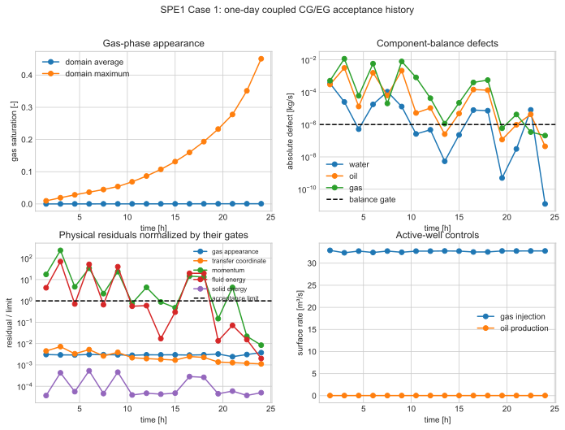
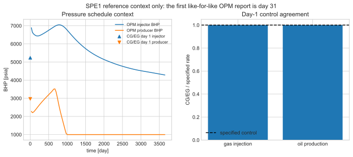

# SPE1 Case 1 — one-day coupled Q2/EG acceptance

## Verdict

The finite-deformation, solid-reference Q2/EG SPE1 Case 1 calculation passes
the one-day coupled acceptance at 86,400 s. It uses the full 10 x 10 x 3
physical-cell mesh, represented by 1,800 TET10 elements, four MPI ranks, and
distributed SuperLU. The artifact records no rejected or nonconverged step, no
NaN/infinity, and no factor-memory failure.

This is a **one-day coupled acceptance**, not a completed SPE1 benchmark
comparison. The official ten-year schedule and like-for-like OPM observable
comparison remain pending. The first comparable OPM report is day 31.

The authoritative evidence is listed in [the evidence ledger](spe1_case1_evidence.yml).
The website entry is [docs/examples/spe1-case1.md](../../docs/examples/spe1-case1.md).

## Active and inactive physics

The simulation represents a deformable solid matrix and water, oil, and gas
fluid phases. It conserves stock-tank water, oil, and gas on the solid
reference configuration. The gas component occurs as both free gas and gas
dissolved in oil. The solid is a registered constituent and its deformation is
solved, not prescribed.

Each fluid-component row is the solid-reference balance

\[
  \tag{SPE1-1: reference component balance}
  \frac{\partial (J\rho^\alpha)}{\partial t}
  + \operatorname{Div}_X W^\alpha = Jq^\alpha .
\]

Here, \(J\) is the solid-reference Jacobian, \(\rho^\alpha\) is the
current bulk partial density, \(W^\alpha\) is the pulled-back component
flux, and \(q^\alpha\) is the current-volume source. The black-oil
water/oil/gas identifications trace to
eq:black_oil_water_balance, eq:black_oil_oil_balance, and
eq:black_oil_gas_balance in
[the implementation map](../../implementation_paper/equation_to_moose_map.yml).

The phase-volume row is

\[
  \tag{SPE1-2: phase-volume closure}
  \phi_s+\phi_w+\phi_o+\phi_g=1 .
\]

The calculation solves Q2 solid displacement, an equilibrium gas-appearance
closure with a reconstructed phase-transfer rate, a transfer coordinate
\(\tau\), separate fluid and solid temperatures, and the associated
generalized transfer work and interphase heat exchange. The finite kinetic
gas-transformation closure is inactive in the acceptance command. SPE1 PVT,
relative permeability, grid, layer, well, and control data are benchmark
inputs. Capillary pressure, acceleration, and electric-potential flux terms
are inactive in this deck. The skeleton, transfer resistance, thermal
specialization, pressure gauge, and external mechanical/thermal data are
declared specializations, rather than calibrated SPE1 reference data.

The DRSDT=0 phase-appearance closure requires a reconstructed transfer
multiplier:

\[
  \tag{SPE1-3: reconstructed transfer multiplier}
  r_{\mathrm{tr}}=r_{\mathrm{tr}}^{P1}+r_{\mathrm{tr}}^{P0}.
\]

The P0 enrichment is supplied to the PVT material. Omitting it makes the local
closure residual insensitive to an active unknown and produces a rank-deficient
phase-appearance block.

## Deck provenance and CG/EG spaces

The top-level deck is
[spe1_case1_q2_eg_phase_transforming.i](../../moose_app/examples/spe1_case1_q2_eg_phase_transforming.i).
Its resolved input tree contains:

1. spe1_case1_q2_eg_transient.i: variables, initial conditions, materials,
   kernels, facet terms, wells, executioner, and outputs.
2. input/includes/mesh/spe1_case1_3d_q2_tet10.i: the 300-cell SPE1 mapping,
   compatible TET10 Q2/EG mesh, and completion blocks.
3. input/includes/materials/spe1_case1_black_oil_pvt.i: PVT, capillary,
   relative-permeability, and active-phase data.
4. input/includes/materials/solid_phase_mass_volume.i: solid constituent
   storage and volume data.

| Quantity | Space | Role |
|---|---|---|
| Displacement | Q2 Lagrange | finite-deformation kinematics and momentum |
| Oil pressure and \(\tau\) | P1 Lagrange + P0 | continuous backbone plus cell correction |
| Water saturation | P2 Lagrange + P0 | reconstructed physical saturation |
| Gas saturation | P2 Bernstein + P0 | bounded phase appearance/disappearance |
| Solution gas-oil ratio | P1 Lagrange | continuous black-oil closure |
| Transfer multiplier | P1 Lagrange + P0 | coupled phase partition |
| Fluid and solid temperature | continuous Lagrange | subsystem energy balances |

The enriched quantities are reconstructed before PVT, flux, stress,
phase-transfer, and well evaluations. EG interior-facet flux and symmetry
operators and weak no-flow boundary operators close the enriched scalar rows.

`deck_status: preserved`

## MOOSE residual and material audit

The precise selected flux laws, storage and source property names, and
reference-domain weak residual are documented in the website entry. In
particular, the assembled balance flux is the material-frame reference flux
\(W\), not the conventional fixed-frame volumetric Darcy velocity.

This map supplements
[moose_app/doc/theory_traceability.yml](../../moose_app/doc/theory_traceability.yml)
and the implementation-paper map.

| Physical task | MOOSE objects | Acceptance observable |
|---|---|---|
| Solid kinematics/storage | ADSolidReferenceKinematics; ADSolidPhaseMassVolumeMaterial | minimum \(J\), matrix storage |
| Solid momentum | ADReferenceSolidMomentum; reference-stress materials | x/y/z weak momentum residuals |
| Water/oil/gas balances | ADEnrichedGalerkinScalarBalance; ADEnrichedGalerkinScalarEnrichmentBalance | component balances |
| EG facets/boundaries | ADEnrichedGalerkinFluxDG; ADEnrichedGalerkinSymmetryDG; ADEnrichedGalerkinPenaltyBC | scalar convergence |
| Volume and scalar closure | ADMaterialPropertyResidual | phase-volume and solution-gas constraints |
| Black-oil phase state | ADBlackOilBenchmarkPVTMaterial; ADBlackOilPVTMaterial; capillary and relative-permeability materials | gas appearance and saturation |
| Water flux | ADStandardDarcyReferenceFluxMaterial | water reference-component balance |
| Oil/gas flux | ADPhaseTransformingDarcyReferenceFluxMaterial; ADPhaseConversionSourceMaterial | phase-transforming reference flux and transfer work |
| Transfer and energy | ADTauEvolutionMaterial; reaction/conversion and generalized-transfer-work materials | affinity, force, power, \(\tau\), energy |
| Wells/control | ADBlackOilPeacemanWellMaterial; BlackOilNodalWellControl | BHP and rates |

The residual objects consume AD material properties. Thermodynamics, phase
state, and kinematics remain explicit materials, not hidden in a monolithic
balance kernel.

## Reproduction commands and artifacts

The exact command is retained in
[command.txt](../results/spe1_case1/one_day_coupled_acceptance_20260820/command.txt).

~~~sh
/home/jfoster/miniconda3/bin/conda run --no-capture-output -n moose \
  python validation/scripts/check_spe1_q2_eg_phase_appearance.py \
  --mpi-ranks 4 --active-wells --drsdt-closure --superlu \
  --dt-seconds 5400 --adaptive-growth-factor 1 --nl-abs-tol 0.1 \
  --artifacts-dir validation/results/spe1_case1/<new-run-directory>
~~~

The harness records the resolved input tree, deck/executable/verifier hashes,
MOOSE patch-series hash, command, scalar history, solver log, and final
summary. The accepted artifact records identical before/after provenance.

`command_status: preserved`

Useful agent prompts:

> Reproduce the SPE1 one-day coupled acceptance from its recorded command.
> Verify deck, executable, input-tree, and verifier hashes first. Use four MPI
> ranks, SuperLU, the 5,400 s schedule, and DRSDT closure. Report every
> physical gate and do not claim an OPM comparison beyond day one.

> Diagnose an SPE1 phase-appearance stall. Confirm that the reconstructed P0
> transfer-multiplier enrichment reaches the PVT material, then inspect the
> gas-appearance residual, phase-volume constraint, component balances, and
> PETSc/SuperLU events. Do not relax physical gates or replace the coupled
> finite-deformation calculation with an FV or fixed-skeleton result.

## Quantitative gates

Values come directly from
[verification_summary.json](../results/spe1_case1/one_day_coupled_acceptance_20260820/verification_summary.json).

| Check | Limit | Final value |
|---|---:|---:|
| Gas-appearance equilibrium L2 | \(1.0\times10^{-7}\) | \(3.76\times10^{-10}\) |
| Gas / oil / water balance [kg/s] | \(1.0\times10^{-6}\) each | \(2.07\times10^{-7}\) / \(-4.47\times10^{-8}\) / \(-1.23\times10^{-11}\) |
| Phase-volume L2 | \(1.0\times10^{-8}\) | 0 |
| Solution-gas constraint L2 | monitor | \(1.66\times10^{-12}\) |
| \(\tau\) evolution L2 | \(1.0\times10^{-7}\) | \(1.11\times10^{-10}\) |
| Largest momentum weak residual | \(1.0\times10^{-7}\) | \(8.43\times10^{-10}\) |
| Fluid / solid energy residual | \(1.0\times10^{-7}\) each | \(2.00\times10^{-10}\) / \(4.98\times10^{-12}\) |
| Minimum gas saturation | \(-1.0\times10^{-12}\) | 0 |
| Minimum transfer dissipation | \(-1.0\times10^{-12}\) | \(-6.27\times10^{-13}\) |

The nonlinear absolute tolerance 0.1 is a runtime stopping control for the
active-set residual floor. It does not replace any physical gate in this table.

## Convergence, robustness, and performance

The accepted run advances sixteen 5,400 s increments to one day with four-rank
distributed SuperLU and no rejected/nonconverged increments. The solver log is
preserved with the artifact; this report does not promote one machine's wall
time to a general performance claim.

The earlier stall was caused by a missing P0 transfer-multiplier coupling in
the PVT reconstruction. The coupled multiplier-like block benefits from a
coupled LU factorization. SuperLU changes the linear-solver treatment, not the
model or its acceptance gates.

## Official reference comparison

The pinned reference is
[spe1_case1_opm_flow_2021_10.csv](../reference_data/spe1_case1_opm_flow_2021_10.csv).
It supplies schedule context and future comparison targets. No like-for-like
external observable result is claimed because the accepted calculation ends at
day 1 and the first OPM report is day 31.

`official_horizon_status: pending`

A later comparison must use matching report times and equivalent field GOR,
BHPs, well rates, cumulative volumes, block pressures, and report-block gas
saturation. Those errors are physical results, not numerical gates that may be
met by tuning or by substituting prescribed/cached values.

## Plots and source-data provenance

[plot_spe1_one_day_acceptance.py](../scripts/plot_spe1_one_day_acceptance.py)
generates the following figures solely from the accepted scalar history. It
refuses an artifact that does not pass or whose provenance changed during the
run. The accepted artifact has no spatial field outputs, so spatial maps are
not shown.

`source_data_status: present`

*Figure 1. Gas appearance, component balance, normalized physical residuals,
and active-well rates. Dashed lines identify applicable acceptance limits.*

*Figure 2. OPM schedule context and day-one control agreement. This is not a
like-for-like OPM comparison.*

## Remaining blockers

1. Advance the coupled Q2/EG model through the official ten-year schedule.
2. Compare like-for-like OPM observables beginning at day 31.
3. Complete calibrated scope for thermal, transfer-resistance, pressure-gauge,
   skeleton, and boundary specializations when reference data are available.
4. Maintain the reduced DRSDT and AD-Jacobian regressions as the
   phase-appearance formulation evolves.

Pre-acceptance logs, checkpoints, figures, and summaries are not mixed with
this evidence and must not be cited as evidence for the accepted deck.
