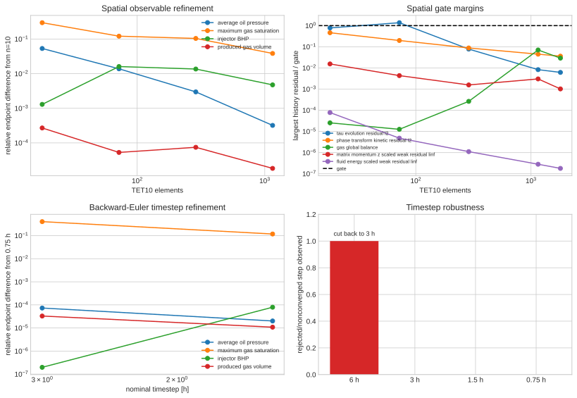
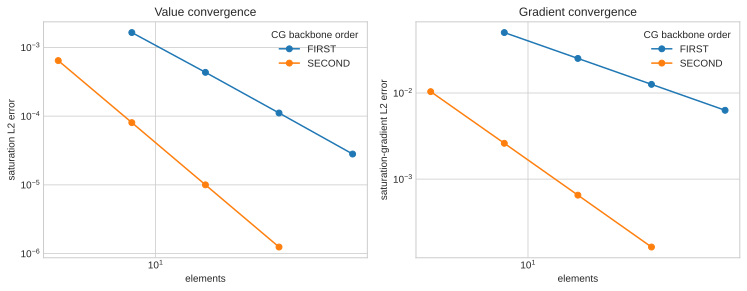

# SPE1 Case 1 — phase-transforming CG/EG verification report

## Verdict

The one-day, full-mesh, eight-rank official-schedule prefix through 20,250 s
passes with zero rejected or nonconverged solves and all configured gates.
The complete one-day kinetic-path calculation reaches 86,400 s with zero
rejected steps.  SPE1 is **not** yet accepted: the rate-independent `DRSDT=0`
phase-appearance acceptance currently fails on the reworked 2026-08-17 deck
(inner-Newton residual floor `4.481544e-07`), and the official ten-year
trajectory, matched black-oil observables, and thermal-scope items remain
open.  Current status and the full attempt record:
`agent_workflows/runbooks/spe1_acceptance_status.md`.

## Current official-schedule status

The full-mesh, eight-rank official-schedule prefix through 20,250 s has passed.
It contains thirty accepted 675 s increments, no rejected or nonconverged
solve, the complete restart-integrity sequence, and all active mass, momentum,
phase-volume, thermodynamic-identity, and energy gates.  The checkpoint and
machine-readable evidence are preserved in
[`pretransition_dt675_checkpoint_20260810`](../results/spe1_case1/pretransition_dt675_checkpoint_20260810/verification_summary.json).

The RSLS replay of the subsequent 20,250 to 20,925 s increment failed.  Its
nonlinear residual reached `3.159422e-06` and remained at that value through
iteration 120 while the linear residual remained near machine precision.  The
675 s solve then reported `DIVERGED_MAX_IT`; MOOSE accepted a 337.5 s retry,
and the diagnostic recorded both the rejected solve and the resulting final
time of 20,587.5 s.  The identical SSLS replay also reported
`DIVERGED_MAX_IT` at iteration 120, with residual `3.329151e-06`.

The PETSc VI monitor identifies the numerical mechanism.  The SSLS replay
with the basic line search began with 27 active lower constraints out of 4,841
bounded degrees of freedom.  Its first Newton update activated 1,805 lower
constraints, and later iterations alternated between approximately 4,400 and
4,700 active lower constraints while the residual alternated around
`1e-6`.  The basic-line-search run was therefore retained as a diagnostic
artifact rather than an acceptance attempt.  The logs are preserved in
[`replay_rsls_20250_to20925_20260810`](../results/spe1_case1/replay_rsls_20250_to20925_20260810/solver.log),
[`replay_ssls_20250_to20925_20260810`](../results/spe1_case1/replay_ssls_20250_to20925_20260810/solver.log),
and
[`replay_ssls_basic_vi_20250_to20925_20260810`](../results/spe1_case1/replay_ssls_basic_vi_20250_to20925_20260810/solver.log).

An identity-reconstruction candidate with the existing
`SaturationSimplexGeneralDamper` was also examined.  It removes the separate
P0 lower bounds and limits the combined Bernstein-plus-P0 water and gas
coefficients.  At the restored disappearing-gas state, its first three Newton
iterations each returned a damping factor of zero at the initial residual
`1.534663e+01`; the candidate cannot take a step and is not an acceptance
configuration.  The partial diagnostic log is retained in
[`replay_simplex_damper_20250_to20925_20260810`](../results/spe1_case1/replay_simplex_damper_20250_to20925_20260810/solver.log).
The admissibility condition couples a shared Bernstein coefficient to its
element P0 correction, so independent box bounds and a single global damping
factor cannot represent the required active set.

A second candidate used a signed multiplicative P0 enrichment with only the
Bernstein backbones bounded.  It entered the strict increment, then reported
`DIVERGED_LINE_SEARCH` on its first Newton iteration; the subsequent cutback
assembled an exactly zero Jacobian column.  At an exactly absent gas phase the
multiplicative P0 degree of freedom has no residual sensitivity, so this
parameterization cannot supply a regular local correction at phase appearance.
The candidate was stopped after that diagnostic and is not retained in the
application.  Its log is preserved in
[`replay_multiplicative_20250_to20925_20260810`](../results/spe1_case1/replay_multiplicative_20250_to20925_20260810/solver.log).

The RSLS critical-point line-search replay reduced the first five nonlinear
residuals from `1.534663e+01` to `1.312977e-05`, then reached a persistent
`4.953e-06` plateau by iterations 12--19 with linear residuals near
`1e-19`.  It was retained as a solver-globalization diagnostic and stopped
before any cutback result could be mistaken for a strict-step acceptance
result.  The log is preserved in
[`replay_rsls_cp_20250_to20925_20260810`](../results/spe1_case1/replay_rsls_cp_20250_to20925_20260810/solver.log).

RSLS with the L2 line search accepts the same strict increment in one solve
without a rejected step.  The restart comparison is exact across all required
state, control, and mass diagnostics, and the independent time-history audit
passes every active numerical and physical gate through 20,925 s.  A subsequent
two consecutive ten-step continuations accept every fixed 675 s increment
from 20,250 through 33,750 s, with no rejected or nonconverged solve.  Their
restart comparisons are exact, and their independent audits record zero
failures across the active mass, momentum, phase-volume, thermodynamic, and
energy gates.  The strict
continuation commands select this line search, and the acceptance runner
records an explicit `--line-search l2` override for a provenance-controlled
official run.  The machine-readable results are preserved in
[`replay_rsls_l2_20250_to20925_20260810`](../results/spe1_case1/replay_rsls_l2_20250_to20925_20260810/summary.json)
and
[`continuation_rsls_l2_20250_to27000_20260810`](../results/spe1_case1/continuation_rsls_l2_20250_to27000_20260810/summary.json),
and
[`continuation_rsls_l2_27000_to33750_20260810`](../results/spe1_case1/continuation_rsls_l2_27000_to33750_20260810/summary.json).

The provenance-locked official-schedule pilot through 86,400 s passes the
configured solver, conservation, mechanics, phase-volume, thermodynamic, and
energy gates.
It retains the full 32-step closed-domain equilibration, the uninterrupted
and checkpointed 89,100 s restart-equivalence step, and eight 10,800 s active
production steps.  The production schedule crosses phase appearance in its
second 10,800 s step without a rejected or nonconverged solve.  The final
time-history audit records zero failures, and every restart comparison passes.
The complete artifact, including provenance and solver-event records, is
[`official_l2_pilot_day1_20260810`](../results/spe1_case1/official_l2_pilot_day1_20260810/verification_summary.json).
This report retains the one-day result below as a baseline coupled
verification, and the official-reference comparison remains pending until the
complete 10-year schedule has accepted steps and matched OPM observables.

### Dissolved-gas history status

The retained fields do not satisfy the SPE1 `DRSDT=0` dissolved-gas history
constraint at the element level.  In the one-day production trajectory, the
sampled solution gas-oil ratio reaches `226.421940893`, above the initialized
value `226.196660482`, and individual elements recover dissolved gas between
accepted steps.  The stage-0 equilibration fields show the same behavior.  The
new elementwise audit records these violations separately from the configured
residual and conservation gates and makes them an acceptance failure.

Thus, the one-day artifact remains evidence that the coupled Q2/EG residual
path advances and satisfies its configured numerical gates.  It is not yet
physical SPE1 acceptance, and the Day-31 external run is deferred until the
production equation set enforces the required dissolved-gas history.

### Required equation-set repair

The repair cannot add the PVT history residual as a fourth equation to the
current local system.  The production variables presently pair a P1 continuous
solution gas-oil ratio with a P2-plus-P0 gas saturation and an element-local P2
conversion-rate field.  The three corresponding rows are total stock-tank-gas
conservation, free-gas phase balance, and the finite-rate kinetic relation.
The history law supplies a fourth condition unless it replaces one of those
rows, and its P1 representation cannot replace the P2 kinetic row without a
new compatible discrete partition.

An SPE1-fidelity branch must retain total stock-tank-gas conservation, enforce
the pressure-and-history limit on dissolved gas, and determine the free-gas
partition and conversion source consistently.  If it replaces the finite-rate
kinetic closure, the conversion source used by momentum and energy must be
derived from the resulting phase partition and its dissipation treatment must
be established.  If it retains the kinetic closure, the irreversible history
constraint requires an extended constrained rate law with its own admissibility
and energy evidence.  Either route requires a mapped reduced test, an AD
Jacobian check, and renewed coupled acceptance evidence before it can replace
the present production path.

The existing `irreversible_solution_gas_history_1d` regression verifies the PVT
history material in isolation by solving its residual for the dissolved-gas
field.  It contains neither the production total-gas balance nor the free-gas
phase balance, and it uses none of the production P1/P2-plus-P0 field
partition.  It therefore establishes the PVT law but cannot establish the
coupled production formulation required here.

`spe1_drsdt_zero_coupled_partition_1d` supplies the next reduced evidence.
With prescribed pressure, porosity, and water saturation, it solves P1 fields
for dissolved gas, free-gas saturation, and the phase-transfer rate.  The
total gas-storage row, free-gas storage/source row, and PVT history row reduce
the initialized ratio from 1.5 to 1.2, increase free-gas saturation from 0.1
to 0.6025641025641, and leave all three residual diagnostics below
`1.2e-16`.  Its AD Jacobian test passes.  The phase-transfer rate supplies a
multiplier-like off-diagonal block, so the reduced problem uses a coupled LU
factorization rather than an independent variable-block factorization.  This
test establishes a coupled phase-partition candidate; the production design
still requires compatible P2-plus-P0 saturation spaces and a derived
conversion momentum, energy, and dissipation treatment.

`spe1_drsdt_zero_coupled_partition_eg_1d` then uses the production P1
dissolved-gas and transfer-rate spaces with the P2 Bernstein plus P0 free-gas
partition.  From the SPE1-compatible initially gas-free state, the history
row gives \(R_s=1.2\), the reconstructed free-gas saturation is
\(0.57435897435897\), and the phase-transfer rate is
\(0.18092307692308\).  The total-gas and free-gas storage integrals are below
\(6\times10^{-17}\), and its AD Jacobian test passes.  The reduced
thermodynamic specialization passes the partition rate through the production
reaction-network source interface and gives affinity, generalized force, and
generalized-force-rate power below \(1.2\times10^{-13}\) and
\(2.0\times10^{-14}\), respectively, while the partition rate is nonzero.
This is the constrained-equilibrium limit of the partition and identifies the
required production interpretation: a
rate-independent constrained or hysteretic phase-transfer mechanism must
establish the momentum, energy, and dissipation treatment before this row can
replace the finite-rate conversion relation.

The [OPM Flow reference manual](https://opm-project.org/wp-content/uploads/2023/06/OPM_Flow_Reference_Manual_2023-04_Rev-0_Release_Notes.pdf)
defines `DRSDT` as the maximum rate at which the solution gas-oil ratio may
increase in a grid cell.  The SPE1 value of zero therefore supplies a unilateral
black-oil rate bound: pressure-driven exsolution can reduce \(R_s\), while
pressure recovery cannot increase it.  It supplies neither a chemical-potential
relation nor a phase-transfer-work or energy law.  The finite-deformation
specialization must introduce that thermodynamic content explicitly and retain
it as a benchmark-specific constitutive assumption.

The pressure-recovery variant of the production-space reduced test raises the
prescribed pressure from \(4200\) to \(4800\) after exsolution.  It retains
\(R_s=1.2\), with the history residual zero and the total-gas balance below
\(7\times10^{-17}\).  The gas saturation changes from \(0.7859649122807\) to
\(0.47454485269778\), and the isolated gas-subsystem source becomes negative.
That diagnostic omits the oil-component balance, phase fluxes, momentum, and
energy equations.  It establishes the ratio history branch and identifies the
next coupled requirement: the complete production system must determine the
phase-source direction together with oil conservation and the thermodynamic
history closure.

A subsequent reduced solved-pressure experiment assembled the P1 oil-component
balance, the P1 total-gas balance, the P2-plus-P0 free-gas balance, and the
P1 history rate with the same reaction-network source interface.  Supplying
only an oil-component source drove the reconstructed gas saturation negative.
The component-consistent source must also contain dissolved gas with the
current solution ratio, scaled by the stock-tank gas-to-oil density ratio.
After that source was supplied, the nonlinear system developed a rank-deficient
Newton path under both an initially gas-free state and an interior free-gas
state; timestep reduction and the phase-absent trial-state guard did not
produce an accepted two-step pressure-recovery solution.  This is not retained
as verification evidence.  It establishes a separate production requirement:
the well/source composition map, phase-appearance treatment, and irreversible
history closure must be derived and tested as one coupled residual system.
The current production well material already supplies the required black-oil
map: its gas source contains the free-gas surface rate together with the
current solution ratio times the oil surface rate
(`moose_app/src/materials/ADBlackOilPeacemanWellMaterial.C:405-418`).  The
reduced failure therefore identifies the missing coupled regression and phase
history closure, rather than a source omission in the production deck.

The current PVT material constructs the attainable ratio from the lesser of
the old-time ratio and the saturated PVTO ratio
(`moose_app/src/materials/ADBlackOilBenchmarkPVTMaterial.C:803-855`).  Its
phase-transform thermodynamics assigns the dissolved-gas free energy from the
gap between that attainable ratio and the current ratio
(`moose_app/src/materials/ADBlackOilPhaseTransformationThermodynamicsMaterial.C:221-270`).
The governing history row therefore reaches zero chemical affinity while the
component balances determine a finite partition rate.  The manuscript permits
dynamic phase transformation to carry the difference of the two phase-transfer
offsets (`sections/multicomponent_solids.tex:2982-3004,4400-4431`), whereas
the existing Onsager row ties the rate directly to that generalized force
(`sections/multicomponent_solids.tex:3594-3614`).  A production history law
must consequently declare the irreversible history state or a nonsmooth
dissipation potential and impose an admissible sign condition on the
constraint-driven rate and the full generalized force.  The existing
conversion source, momentum insertion, and energy-transfer interfaces can
then be evaluated against that law.

An active-well two-by-two restart diagnostic replaced only the production
phase-rate residual with the PVT history residual at runtime. At the initial
state, the minimum solid-reference Jacobian was \(0.9999933\). On the first
675 s Newton correction, the assembled residual increased from \(57.84\) to
\(69.57\), and a trial state produced a nonpositive solid-reference Jacobian.
The same result occurred with the production L2 line search. The diagnostic
therefore establishes that direct substitution of the history row is neither a
stable numerical continuation nor a complete thermodynamic closure. Its
outputs were retained only under `/tmp` and are not acceptance evidence.

## One-day baseline verdict

The one-day, full-mesh SPE1 Case 1 calculation reaches 86,400 s with the
manuscript's nonequilibrium thermodynamics, conversion mass, conversion
momentum, and conversion energy active.  It has zero rejected steps and zero
failures in the configured quantitative gates, while the elementwise
`DRSDT=0` dissolved-gas-history audit fails as reported above.

This is a continuous/enriched Galerkin calculation. It does **not** use a
finite-volume discretization. Fracture is deferred as requested.

The retained artifact is
[`full_active_phase_transforming_all_gates_runtime_closure_superlu_dt3h_9eae27f_reproducible`](../results/spe1_case1/full_active_phase_transforming_all_gates_runtime_closure_superlu_dt3h_9eae27f_reproducible/verification_summary.json).
It contains the exact command, solver log, CSV histories, all spatial samples,
Exodus output, independent history audit, provenance record, and figures. The
earlier f92a425 artifact is preserved as historical evidence; its input closure
is a documented provenance gap (see "Deck provenance and CG/EG spaces").

The one-day result verifies the coupled implementation against its configured
numerical gates and exercises the SPE1 controls.  The pinned OPM reference's
first saved state is day 31, so an official physical comparison begins at that
report time after the dissolved-gas history constraint is enforced.

### DRSDT=0 phase-appearance gate (2026-08-12, superseded 2026-08-18)

The rate-independent phase-appearance gate was implemented on 2026-08-12 and
the reduced 1x1x3 gate passed on the then-current deck
(`gas_phase_transformation_rate = MONOMIAL SECOND`).  The gate verifier
(`validation/scripts/check_spe1_q2_eg_phase_appearance.py --drsdt-closure`)
deactivates the finite-rate Onsager row (`Kernels/inactive=gas_phase_transformation_closure`)
and drives the element-local phase-transfer rate with the deck's rate-independent
dissolved-gas history row.  A lagged active-set (Picard) outer loop refreshes
the phase-appearance flag between fixed-point iterations; its convergence
object is the `gas_active_set_mismatch_integral` postprocessor with
`direct_pp_value=true` and `custom_abs_tol=1e-6`.  The `[spe1_pvt]` material
freezes the phase-appearance branch at the previous fixed-point state, so the
active set cannot flip inside the inner Newton solve.

On the pre-rewrite deck, the 1x1x3 reduced mesh (18 TET10 elements, one MPI
rank) reported `Solve Converged!` and `CONVERGED_PP` on its first fixed-point
iteration on every production step, with `gas_active_set_mismatch_integral =
0.0`, `average_solution_gas_oil_ratio = 232.83`, `average_gas_saturation =
4.914e-11`, `injector_bhp = 34.89 MPa`, and `minimum_J = 1.00023`.  At 1x1x3 no
cell flipped active over the one-day horizon, so that result was primarily a
regression signal for the injector stall fix; the 10x10x3 DRSDT run remained the
active-set stress test.

**Status update 2026-08-18.**  After the 2026-08-17 deck rework (LAGRANGE
FIRST rate field, simplex-bounded saturation reconstruction, identity-transform
closure saturation, `phase_active_band = 1e-10`, dissolved-gas component flux,
frozen active-set lagged Picard DRSDT closure), the reduced DRSDT acceptance
**no longer passes** on the current deck (deck sha `cc28dabf…`, exe sha
`44c7f7…`, input tree `c469402c…`).  The inner Newton solve stalls at a
residual floor near `4.481544e-07` and grinds to `DIVERGED_MAX_IT` at the first
time step; the run times out.  Relaxing `Executioner/nl_abs_tol` to `1e-6`
makes the inner solve converge but violates the `gas_global_balance` gate
(`+1325` kg/s) with spurious gas appearance (max Sg 0.237, R_s 226.2).  The
previous PASS artifacts in archived `drsdt_gate_artifacts` and
`drsdt_gate_artifacts_v2` directories ran on the
pre-rewrite deck and are not valid evidence for the current deck.  This is the
single blocking item before reduced acceptance can pass again; see
`agent_workflows/runbooks/spe1_acceptance_status.md` for the full attempt
record and remaining work.

A well-material dissolution partition was required to make the first DRSDT
solve feasible.  `ADBlackOilPeacemanWellMaterial` accepts an optional
`saturated_solution_gas_oil_ratio_name` property (default `""`).  When it is
supplied for a gas-injecting completion, the injected gas source splits into a
dissolved fraction absorbed by the R_s row and the residual free-gas fraction,
with the fraction a C1 smoothstep of the undersaturation gap `R_s^sat - R_s`
(one for `R_s^sat >= R_s`, zero for `R_s^sat <= R_s - width`, default width
`0.5`).  Without this partition, all injected gas entered the frozen-inactive
free-gas rows of the first DRSDT solve with no dissolution sink, producing an
infeasible flat residual floor.  The partition preserves `free + dissolved =
total` exactly and leaves the scalar well-control feedback unchanged.  It is
activated only by the DRSDT gate via the verifier's command overrides
(`Materials/injector/saturated_solution_gas_oil_ratio_name=...`); the finite-rate
kinetic acceptance path and all well-material unit tests keep the baseline
partition and pass unchanged.  This partition was exonerated as a failure cause
for the current stall.

## Deck provenance and CG/EG spaces

`deck_status: preserved`.

The acceptance entry point is
[`spe1_case1_q2_eg_phase_transforming_report_superlu.i`](../../moose_app/examples/spe1_case1_q2_eg_phase_transforming_report_superlu.i).
Its recursively resolved input closure contains exactly:

1. `spe1_case1_q2_eg_phase_transforming_report_superlu.i`;
2. `spe1_case1_q2_eg_phase_transforming_report.i`;
3. `spe1_case1_q2_eg_phase_transforming.i`;
4. `spe1_case1_q2_eg_transient.i`;
5. `input/includes/mesh/spe1_case1_3d_q2_tet10.i`;
6. `input/includes/materials/solid_phase_mass_volume.i`;
7. `input/includes/materials/spe1_case1_black_oil_pvt.i`; and
8. `input/templates/distributed_superlu_q2_eg.i`.

The recursive closure hash is
`7492e533788a92eed56b28e1d19ac967b98d7f3f8b44773321d6f661d7dcf9a0`.
This hash and the complete closure were recomputed from the current committed
state; the earlier f92a425 run's recorded closure `2339d82d...` is
unrecoverable from git (no preserved combination reproduces it, and every
recorded run used an uncommitted working tree), so that run is documented as
a provenance gap while its results and figures remain preserved. The complete
launch command is preserved in
[`command.txt`](../results/spe1_case1/full_active_phase_transforming_all_gates_runtime_closure_superlu_dt3h_9eae27f_reproducible/command.txt).

Configuration:

| Item | Accepted selection |
|---|---|
| geometry | official 10 × 10 × 3 SPE1 grid |
| finite-element mesh | 1,800 TET10 elements |
| time integration | backward Euler, 10,800 s nominal step |
| nonlinear coupling | monolithic AD Newton |
| linear solve | SuperLU_DIST direct factorization |
| parallel execution | four MPI ranks |
| simulated horizon | 86,400 s |
| report output | per-step CSV projections plus Exodus |

### CG/EG approximation spaces

| Field | Space | Reason |
|---|---|---|
| solid displacement | Q2 continuous Lagrange | finite-deformation skeleton mechanics |
| oil pressure | P1 CG + element P0 enrichment | locally conservative enriched pressure transport |
| water saturation | Q2 CG + element P0 enrichment | higher-order saturation representation |
| gas saturation | P2 Bernstein CG + element P0 enrichment | higher order plus nonnegative disappearing-phase basis |
| transformation coordinate `tau` | P1 CG + element P0 enrichment | solved nonequilibrium internal coordinate |
| phase-transformation rate | element-local P2 monomial | local kinetic response |
| fluid and solid temperature | P1 continuous Lagrange | two-temperature energy system |

The higher-order saturation selection follows the high-order EG direction used
by Wheeler and collaborators. Existing spatial manufactured-solution evidence
gives approximately third-order P2 value convergence and second-order P2
gradient convergence, compared with approximately second- and first-order P1
behavior. The Bernstein gas basis can attain exactly zero without a negative
nodal shape-function representation.

## Active and inactive physics

| Physics | Concrete input-deck realization | Verification |
|---|---|---|
| finite-deformation porous skeleton | Q2 displacement, solid-reference kinematics, compressible neo-Hookean effective stress, Biot pressure coupling | positive `J`, three momentum residuals, sampled displacements |
| multicomponent mass | solid-reference water/oil/gas storage and fluxes, black-oil PVT/viscosity, relative permeability, gravity and wells | component defects, phase-volume constraint, matrix residual |
| nonequilibrium phase transformation | solved/reconstructed `tau`, dissolved/free-gas `mu`, affinity, generalized force, directional availability and finite-rate kinetics | finite diagnostics, kinetic and tau residuals, three exact identities, dissipation |
| conversion mass | one oil-to-gas rate stitched into oil/gas source kernels with coefficients −1/+1 | global balances and phase-volume gate |
| phase relative momentum | manuscript resistance `phi_f^2 mu_f K_f^-1 + q_f I` and driving `q_f(grad tau-v_s)` | active/inactive/phase-limit Darcy tests |
| overall momentum conversion | each phase adds `J q_f(F^-T Grad_X tau-v_f)`, with reconstructed mobile-phase velocity | x/y/z weak-residual gates and atomic MMS |
| fluid/solid energy | separate storage, conduction and exchange, plus `L_f=mu_f-psi_f+D_f tau/Dt-|v_f|^2/2` conversion work | independent fluid/solid energy residuals and temperature gates |
| well controls | Peaceman gas injector and oil producer with rate/BHP scalar controls | rate-target and BHP-limit gates |
| EG stabilization | separate enriched flux and entropy-viscosity objects | convergence tests and accepted nonlinear trajectory |

This confirms the requested setting: `tau`, both `mu` fields, affinity,
generalized conversion force, dissipation, conversion mass, conversion
momentum, and conversion energy are present and active. The same complete
closure is available to any phase-transforming model through the
`phase_transformation_nonequilibrium.i.template` preset and its individually
selectable kernels/materials.

SPE1 supplies no caloric equation of state, phase-specific Helmholtz-energy
calibration, or matrix intrinsic density. The production deck therefore uses
zero phase Helmholtz values and an explicit untuned matrix density of 2650
kg/m3. These benchmark specializations retain the complete transfer-work and
mixture-gravity terms while delimiting their predictive thermodynamic scope.

Water is deliberately nontransforming in this reaction, so `q_water=0` and
its phase-transforming Darcy expression reduces to the standard reference
Darcy law. Oil and gas use the phase-transforming closure. A disappearing
phase returns zero mobility/flux when phase indicator, density, or relative
permeability vanishes; no artificial division regularization is required.

### Implemented but inactive in SPE1

| Optional term | Why inactive here | Modular selection |
|---|---|---|
| electrical enthalpy, charged transport, Gauss law and Maxwell stress | SPE1 fluids are neutral and provide no electric data | electrical materials/kernels and templates |
| surface-energy gradients and diffuse-interface forces | Case 1 supplies no surface-energy or phase-field data | gradient-energy materials and momentum insertions |
| capillary pressure | Case 1 supplies no capillary table | independent capillary constitutive and gradient objects |
| molecular diffusion/dispersion | absent from the benchmark definition | component diffusion/dispersion flux objects |
| fluid inertia | reservoir quasi-static relative-momentum specialization | selectable inertia/material-derivative kernels |
| fracture | explicitly deferred | not included in this deck |

These omissions are benchmark choices, not gaps in the general implementation.

## Quantitative gates

All gates below are evaluated at 86,400 s by
[`verification_summary.json`](../results/spe1_case1/full_active_phase_transforming_all_gates_runtime_closure_superlu_dt3h_9eae27f_reproducible/verification_summary.json).

| Quantity | Observed | Acceptance gate | Result |
|---|---:|---:|---|
| maximum / minimum gas saturation | 0.2439167 / 8.19e−12 | `(0.001, 1+1e-12]` / `>=-1e-12` | pass |
| finite-rate kinetic residual L2 | 3.70072e−10 | `<=1e−7` | pass |
| reconstructed-tau evolution residual L2 | 1.54188e−10 | `<=1e−7` | pass |
| affinity identity L2 | 0 | `<=1e−12` | pass |
| generalized-force identity L2 | 1.69e−23 | `<=1e−12` | pass |
| force-rate power identity L2 | 0 | `<=1e−12` | pass |
| momentum x / y / z scaled weak L-infinity | 1.39e−12 / 7.89e−13 / 1.49e−11 | each `<=1e−7` | pass |
| fluid / solid energy scaled weak L-infinity | 2.75e−12 / 2.81e−12 | each `<=1e−7` | pass |
| water / oil / gas global defect [kg/s] | −3.28e−13 / −2.76e−12 / 1.33e−12 | absolute `<=1e−6` | pass |
| phase-volume / matrix-component residual | 0 / 0 | `<=1e−8` / `<=1e−6` | pass |
| minimum transformation dissipation | −5.62e−16 | `>=−1e−12` | pass |
| minimum solid-reference Jacobian | 0.9993089 | `>1e−8` | pass |
| fluid / solid mean temperature [K] | 333.15 / 333.15 | each within `1e−8 K` | pass |
| gas injection [m3/s] | 32.77412799588 | target relative error `<=1e−4` | pass |
| oil production [m3/s] | 0.03680261508 | target relative error `<=1e−4` | pass |
| injector / producer BHP [Pa] | 3.61609e7 / 2.04758e7 | operating limits | pass |

The endpoint nonequilibrium state is finite and nontrivial:

| Diagnostic | Endpoint |
|---|---:|
| reconstructed `tau` | 2.2337230e−7 |
| dissolved-gas `mu` | 5.2624167e4 |
| free-gas `mu` | 5.2624167e4 |
| affinity | −1.2775127e−6 |
| generalized conversion force | −1.2775129e−6 |
| mean gas phase-transformation rate | 3.4508830e−14 |

### Independent all-timestep audit

[`time_history_audit.json`](../results/spe1_case1/full_active_phase_transforming_all_gates_runtime_closure_superlu_dt3h_9eae27f_reproducible/time_history_audit.json)
independently reapplies the gates to every accepted nonzero timestep. It reports
eight timesteps, zero failures, and finite `tau`, both `mu`, affinity,
generalized force, and phase rate at every time.

| History quantity | Worst observed magnitude | Gate | Result |
|---|---:|---:|---|
| kinetic residual L2 | 3.70072e−10 | 1e−7 | pass |
| tau evolution residual L2 | 3.88688e−10 | 1e−7 | pass |
| momentum z scaled weak L-infinity | 2.19596e−11 | 1e−7 | pass |
| fluid energy scaled weak L-infinity | 3.23071e−12 | 1e−7 | pass |
| solid energy scaled weak L-infinity | 2.98650e−12 | 1e−7 | pass |
| oil global defect [kg/s] | 1.88362e−9 | 1e−6 | pass |
| gas global defect [kg/s] | 1.07593e−9 | 1e−6 | pass |
| water global defect [kg/s] | 3.66276e−9 | 1e−6 | pass |
| thermodynamic identity residuals | at most 8.39e−22 | 1e−12 | pass |

The solved and independently reconstructed average `tau` agree to roundoff
throughout. Reconstructed `tau` evolves from 4.41169e−8 to 2.23372e−7;
dissolved `mu` and affinity span 5.26003e4 to 5.26242e4 and +1.84918e−7 to
−1.27751e−6, respectively. Thus the test is not passing because transformation
fields are identically zero.

## Plots and source-data provenance

`source_data_status: present`.

These figures are generated by
[`plot_spe1_verified_report.py`](../scripts/plot_spe1_verified_report.py), which
refuses to plot unless endpoint verification, runtime provenance,
development-tree provenance, and the all-timestep audit all pass.

The spatial pressure, saturation, and nonequilibrium figures consume the
`result_physical_element_fields_*.csv` and
`result_phase_rate_element_field_*.csv` files in the accepted artifact. The
mechanics/temperature figure consumes `result_nodal_mechanics_*.csv` and
`result_nodal_temperature_*.csv`; the gate history consumes `result.csv` and
`time_history_audit.json`; the contextual overlay consumes the pinned OPM CSV
named below. [`provenance.json`](../results/spe1_case1/full_active_phase_transforming_all_gates_runtime_closure_superlu_dt3h_9eae27f_reproducible/provenance.json)
hashes the generating deck, executable, verifier, and source trees.

The spatial plots show localized gas appearance around the injector rather than
uniform or oscillatory phase creation. The history plot shows gas growth,
component conservation, all equation residuals normalized by their gates,
the nonequilibrium state, temperature, and solid admissibility together.

## Convergence, robustness, and performance

The spatial study preserves the 3048 m by 3048 m domain, all three physical
layers, one corner completion cell per well, the Q2/CG-EG spaces, the
three-hour timestep, and every active physics term. Each physical cell is
mapped to six TET10 elements. The 1,800-element result is the comparison
reference; this is a numerical-refinement comparison rather than an
exact-solution error estimate.
The convergence harness uses the same phase-transforming residual deck with
monolithic MUMPS rather than the report overlay's SuperLU_DIST selection; the
linear solver changes the algebraic solution route, not the assembled weak
form. Machine-readable results are preserved in
[`convergence_summary_v1.json`](../results/spe1_case1/convergence_summary_v1.json).

| Lateral cells | TET10 elements | History result | Peak `tau` residual / gate | Average-pressure difference from n=10 | Maximum-gas-saturation difference from n=10 |
|---:|---:|---|---:|---:|---:|
| 1 | 18 | pass | 0.776 | 5.35% | 29.7% |
| 2 | 72 | fail: `tau` under-resolved | 1.373 | 1.38% | 12.1% |
| 4 | 288 | pass | 0.0778 | 0.298% | 10.4% |
| 8 | 1,152 | pass | 0.00831 | 0.0321% | 3.85% |
| 10 | 1,800 | pass | 0.00616 | reference | reference |

The 18-element harness provides an independent coupled regression while its
endpoint differences show that it does not resolve the localized gas front.
The failed 72-element datum is retained with the unchanged `1e-7` tau gate.
Against the n=10 reference, the n=4 to n=8 apparent orders are 3.22 for
average pressure, 1.44 for maximum gas saturation, 1.52 and 1.61 for injector
and producer BHP, and 2.02 for produced gas volume.

The timestep study fixes the passing 288-element mesh. The 3 h, 1.5 h, and
0.75 h runs reach one day with 8, 16, and 32 accepted steps, respectively, and
zero rejected solves, factor-memory events, or NaN/infinity diagnostics. The
observed refinement orders are 1.40 for average pressure, 1.28 for maximum gas
saturation, 1.03 for produced gas volume, and 0.97 for producer BHP, consistent
with backward Euler's first-order accuracy. Injector BHP is nonmonotone at this
precision because the rate-controlled well adjusts its scalar pressure; its
three endpoint values agree within 0.008%. A nominal 6 h trial required one
rejected final step and cutback to 3 h, so it is retained as a failed
uniform-step robustness level even though its subsequently accepted states
passed the physics gates.

The saturation MMS isolates basis order from the benchmark's moving front and
well controls. P1+P0 EG gives approximately second-order value and first-order
gradient convergence. P2+P0 EG gives approximately third-order value and
second-order gradient convergence, and its value error at 32 elements is
1.12% of the P1 error. This supports the production P2 saturation backbones;
the Bernstein P2 gas basis also preserves nonnegative coefficients at phase
appearance.

## Official reference comparison

`official_horizon_status: pending`.

The deck reproduces Case 1 geometry, rock/fluid tables, SI conversion,
100,000 Mscf/day gas injection, and 20,000 stb/day oil production. At day 1,
the computed control rates agree with their official targets to approximately
`1.2e−7` relative error for gas injection and `2.5e−8` for oil production.

The pinned external reference is
[`spe1_case1_opm_flow_2021_10.csv`](../reference_data/spe1_case1_opm_flow_2021_10.csv).
Its first saved row is day 31. The OPM-context plot therefore overlays the day-1
CG/EG state on the official schedule but labels the saturation comparison as
not like-for-like. The required next comparison is to run the production CG/EG
deck through the same saved OPM times and report pressure, saturation, GOR,
rate, and cumulative-volume errors at each matched time.  The acceptance
runner now accepts `--opm-comparison` only when an official-schedule endpoint
matches a pinned OPM report day.  It writes the comparison CSV, summary,
figures, command log, and reference/script hashes as descriptive physical
evidence; its differences remain outside the governing-equation acceptance
gates.

The current acceptance runner writes `physical_scope_audit.json` in each new
artifact.  The audit records the resolved PVT-table and OPM-reference hashes
and labels the phase-transfer, thermal, skeleton, and mechanical-boundary
values that SPE1 does not calibrate.  It preserves the distinction between
provenance of a selected model and evidence that would calibrate its physical
specialization.

## Performance and modular-kernel assessment

The accepted report-grade run took 3,314.57 s total wall time for the full
acceptance workflow (33-step equilibration, restart-integrity checks, and the
eight-step production solve) on four MPI ranks; the production solve itself
took 1,410.80 s inside MOOSE. It performed eight converged nonlinear solves,
no rejected step, and no factor-memory event. The first production step
required 17 Newton updates and later steps required 9-16; the elevated first
solve is the phase/control transition, not a dispatch failure.

Individual kernels do not imply an enormous performance penalty. MOOSE
assembles their contributions into the same residual and AD Jacobian. The
dominant observed costs are higher-order Q2/P2 quadrature and unknowns,
monolithic AD coupling, report projections, and distributed direct
factorization. A controlled fused-versus-modular profile is still required
before consolidating any kernel boundary.

## Newton conditioning: phase-transformation-rate scaling

A conditioning defect in the production deck was isolated and fixed on
2026-08-07. The `gas_phase_transformation_rate` variable carried
`scaling = 1e8`. The manuscript kinetic closure is a local algebraic relation
between the conversion rate and the mobility-weighted kinetic force; its
residual is satisfied to O(1e-12) at the physical equilibrium state. The 1e8
row scaling inflated that already-satisfied residual to O(1e-4) in the
scaled norm, which permanently blocked the `nl_abs_tol = 1e-8` convergence
gate in `[Executioner]`. Newton then ground to `nl_max_its = 40` and aborted
`DIVERGED_MAX_IT` at the first one-day step with essentially no reduction of
the scaled residual.

The fix sets `scaling = 1` on `gas_phase_transformation_rate` so the closure
residual is measured in its physical units
([`spe1_case1_q2_eg_transient.i`](../../moose_app/examples/spe1_case1_q2_eg_transient.i),
variable block). Physics is unchanged: component balances, phase-volume
constraint, Fischer--Burmeister complementarity, gas saturation, CG/EG
pressure, conserved solid, and wells all remain active. On the reduced
one-column gate the deck now converges in 9 Newton iterations instead of
grinding through 40. On the full 10 x 10 x 3 mesh at the production 10,800 s
step the same fix converges in 33 iterations (`|R|`: 4.388e2 to 1.7e-10) and
reproduces the physical gates: zero component/phase-volume residuals,
`J_s ~= 0.9999933`, equilibrium dissolved/free-gas chemical potentials,
affinity and generalized force to roundoff, and zero thermodynamic-identity
residuals.

The identical `scaling = 1e8` defect existed in the SPE2 black-oil candidate
fragment
[`spe2_black_oil_q2_eg.i`](../../moose_app/input/includes/fields/spe2_black_oil_q2_eg.i);
it was fixed to `scaling = 1` with the same rationale while that fragment
remains candidate (not yet verified) in the verified-block registry.

## Reproduction commands and artifacts

`command_status: preserved`. The exact four-rank command and every runtime
override are stored in
[`command.txt`](../results/spe1_case1/full_active_phase_transforming_all_gates_runtime_closure_superlu_dt3h_9eae27f_reproducible/command.txt).
The preserved artifact directory contains `solver.log`, `result.csv`, Exodus
and spatial CSV output, `verification_summary.json`, `time_history_audit.json`,
`solver_events.json`, `provenance.json`, and the generated figures. New runner
artifacts additionally contain `physical_scope_audit.json`. Reproduction must
use that preserved command as one shell command inside the recorded MOOSE Conda
environment; shortening its active-object overrides changes the model.

Both runtime and full development-tree provenance stayed unchanged during the
accepted run. Runtime provenance hashes the complete recursive deck closure,
executable, application/test libraries, verifier, and governing manuscript.

| Artifact | SHA-256 |
|---|---|
| application library | `c1984258cd5977ad209b19cb168844e8d1b3e49653491d4a095a6d709bea2883` |
| executable | `44c7f7bed89dc015c3a92247e7e793ec21a1a2c34c38627be2086a5e0c2ca8ad` |
| verifier | `92faba72b0e2de7424c2036da0e8fbf96e7b4ce78f749e6a38ceb30ea7a7b8b5` |
| manuscript tree | `9f783c2f7a04386c06e397919dff81bf2d62cbb3959beb419186041d7451d089` |
| development input/source tree | `491f42b14112c6fb503b6b7cbe2a7e2ac08e2b56a05f4f88152c4c682cff9169` |

MOOSE base commit: `abafb58b67a6037c6723ffeb19647c84484466da`.
The only core patch is the documented pre-existing premake-check patch in
`moose_app/patches/moose/series.yml`. All new phase-transformation terms are
application-level; no additional MOOSE-core modification was needed. Any
future core change must be isolated as a saved patch, added to the MOOSE setup
skill/manifest, regression tested, and assessed for an upstream pull request.

## Remaining blockers

0. **Restore reduced DRSDT acceptance (blocking, current).**  The reduced
   1x1x3 DRSDT acceptance fails on the 2026-08-17 reworked deck at a residual
   floor near `4.481544e-07` (`DIVERGED_MAX_IT`, step 1).  The stale
   pre-rewrite PASS artifacts must not be used as evidence.  Resolve the stall
   (prime suspects: LAGRANGE FIRST rate field, identity-transform closure
   saturation coupling, or `phase_active_band = 1e-10`), or revert/stabilize
   the deck rework with John's approval.  Full attempt record and reproduction
   commands: `agent_workflows/runbooks/spe1_acceptance_status.md`.

1. **Governing DRSDT=0 phase partition.**  The retained full-mesh fields
   violate the irreversible dissolved-gas history condition because the
   production residual set retains the finite-rate Onsager row in place of a
   governing history row.  The reduced P1/P2-plus-P0 partition supplies a
   square, conservative discrete system with a nonzero transfer rate at zero
   affinity.  A production repair must therefore define the corresponding
   rate-independent constrained or hysteretic phase-transfer mechanism,
   re-establish its generalized transfer work, conversion momentum, energy,
   and dissipation treatment, and pass mapped reduced and coupled tests.  This
   physical-model gate precedes any additional long-horizon production run.

2. **Official numerical trajectory.**  After the governing phase partition
   has passed the physical-model gate, the complete ten-year CG/EG trajectory
   requires accepted steps through every saved OPM time, with no rejected or
   nonconverged solve.  The L2 RSLS continuations accepted twenty fixed 675 s
   increments from 20,250 through 33,750 s, and the provenance-locked
   official pilot accepted the complete first day in eight 10,800 s steps.
   Both paths cross the phase-appearance interval that stalled under RSLS and
   SSLS backtracking and under the critical-point line search.  The VI-monitor
   diagnostics still show a rapid transition from 27 active lower constraints
   to several thousand and a subsequent active-set cycle under the basic line
   search.

   The current lower bounds apply both to the P2 Bernstein gas backbone and to
   its P0 EG enrichment (`moose_app/examples/spe1_case1_q2_eg_transient.i:1101-1113`),
   while the reconstructed physical saturation is separately mapped into the
   admissible range
   (`moose_app/examples/spe1_case1_q2_eg_transient.i:315-327`).  This couples phase admissibility to the
   sign of the local EG correction.  An inactive-set audit should identify the
   bound coefficients at the stalled increment and establish whether the EG
   correction needs a signed, physically admissible reconstruction before any
   bounded-space change is adopted.

3. **Matched black-oil observables.**  The pinned reference supplies field oil
   rate, field GOR, injector and producer pressures and BHPs, well rates and
   cumulative oil and gas volumes.  A completed production trajectory must
   compare these quantities at its corresponding saved times, beginning at day
   31, and report the errors without tuning the physical specification to a
   comparison result.

4. **Thermal specialization.**  The manuscript subsystem balance includes
   phase stress power, pressure--density and phase-volume work, heat flux,
   conversion work and external energy supply
   (`sections/multicomponent_solids.tex:1020-1054`).  The SPE deck currently
   solves storage, nonadvective diffusion, interphase exchange and conversion
   work (`moose_app/examples/spe1_case1_q2_eg_transient.i:1035-1073`), while
   its supplied caloric data are constant storage coefficients with zero matrix
   reference thermodynamics and external work
   (`moose_app/examples/spe1_case1_q2_eg_transient.i:528-539`).  The reference CSV
   has no thermal or enthalpy observable.  Completion therefore requires an
   explicit isothermal black-oil scope, or a thermal data set and a documented
   implementation of the applicable energy transport, well-energy and
   finite-deformation power terms.  The reusable two-temperature template
   already exposes relative internal-energy advection
   (`moose_app/input/templates/two_temperature_energy_hierarchy.i.template:41-46`)
   for the latter path.

5. **Mechanics and phase-transfer calibration.**  The finite-deformation
   specialization maps SPE1 rock compressibility to a neo-Hookean bulk modulus
   and selects Poisson ratio 0.25 (`moose_app/examples/spe1_case1_q2_eg_transient.i:285-300`),
   uses an explicit 2650 kg/m3 grain density
   (`moose_app/input/includes/materials/solid_phase_mass_volume.i:3-8`), and
   disables the PVT material's conventional pressure-dependent-porosity path
   (`moose_app/examples/spe1_case1_q2_eg_transient.i:10`).  The official PVT
   specialization fixes the PVTO/PVDG data and retains the `DRSDT=0`
   undersaturated-history branch
   (`moose_app/input/includes/materials/spe1_case1_black_oil_pvt.i:1-40`).
   The phase-transfer specialization then supplies a synthetic specific-free-
   energy curvature of `1` J/kg and zero Helmholtz datums
   (`moose_app/examples/spe1_case1_q2_eg_transient.i:601-618`), while the
   reaction row enforces the linear law
   `rate = 1e-8 * availability * generalized_force`
   (`moose_app/examples/spe1_case1_q2_eg_transient.i:655-667`;
   `moose_app/src/materials/ADReactionNetworkMaterial.C:346-367`).  The PVT
   data constrain the attainable solution-gas ratio, and the added curvature
   and mobility determine the relaxation toward it.  A sensitivity study or a
   benchmark-specific constitutive mapping is therefore required before the
   transfer rate, gas-appearance timing, mechanics, or temperatures can be
   interpreted as SPE1 predictions.  The geostatic reference stress, zero
   external traction, bottom normal support, and minimum rigid-body constraints
   are likewise explicit deformable-skeleton boundary choices
   (`moose_app/examples/spe1_case1_q2_eg_transient.i:1-10,156-172,291-300,1133-1155`).
   SPE1 supplies no displacement, stress, or compaction observable to select
   among such mechanically admissible specializations.  Mechanics results
   therefore establish consistency of the coupled residual path; their
   physical interpretation requires an independently justified rock and
   boundary-data specialization.

   A separately labeled 72-element, one-day sensitivity screen confirms that
   the published one-day observables cannot calibrate the synthetic
   phase-transfer closure.  Relative to the `K=1` J/kg and `L=1e-8` baseline,
   setting either `L=1e-6` or `K=100` increased the average transformation
   rate from `4.87946e-13` to approximately `4.879e-11`.  The curvature change
   also increased the average affinity from `-6.68447e-5` to `-6.68497e-3`.
   In both cases the average gas saturation changed by about `8e-6` relative
   and all pressure and BHP changes remained below `1e-7` relative.  The three
   artifacts retain their commands and provenance under
   `validation/results/spe1_case1/kinetic_sensitivity_n2_*_20260811/`.
   Each trajectory reached 86,400 s without a rejected or nonconverged step.
   The baseline misses the 72-element tau gate by 15 percent, while the
   perturbed cases also expose scale-dependent kinetic-residual, temperature,
   and dissipation roundoff gates.  This screen is diagnostic evidence only;
   a calibrated transfer model requires longer matched observables, beginning
   with the day-31 OPM report point, on an acceptance-quality mesh.

6. **Energy-gate dimensions.**  `ADMaterialScalarL2Error` returns the square
   root of a volume integral (`moose_app/src/postprocessors/ADMaterialScalarL2Error.C:29-38`).
   A strong residual in W/m3 therefore produces an L2 quantity in W/m^(3/2),
   whereas the present local gate labels and sets it as W/m3
   (`validation/scripts/spe1_energy_gates.py:16-23`).  A mesh-independent RMS
   residual or a correctly volume-scaled L2 limit should be validated before
   using this gate for physical energy-balance acceptance.  The existing gate
   must remain intact until that replacement has mapped evidence.

7. **Numerical-cost evidence.**  The accepted official L2 pilot consumed
   2,426.98 s wall time on eight ranks.  Its 1,293.11 s equilibration and
   29.97 s restart-equivalence solves occur once; the eight active production
   steps consumed the remaining time, or approximately 137.99 s per 10,800 s
   increment.  Holding that step size and cost for 29,200 increments gives a
   46.63 wall-day ten-year projection before output, queue, and later
   nonlinear-cost variation.  Adaptive growth can reduce that estimate only
   after the accepted iteration history supports larger steps.  The full
   schedule therefore requires a monitored long-run resource allocation.
